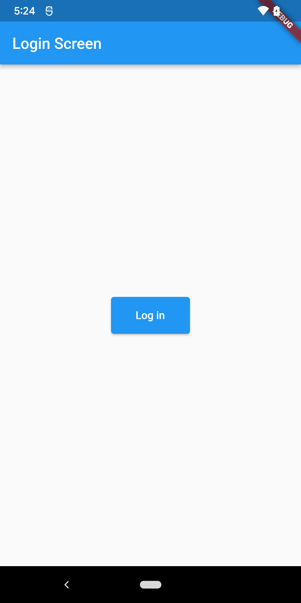
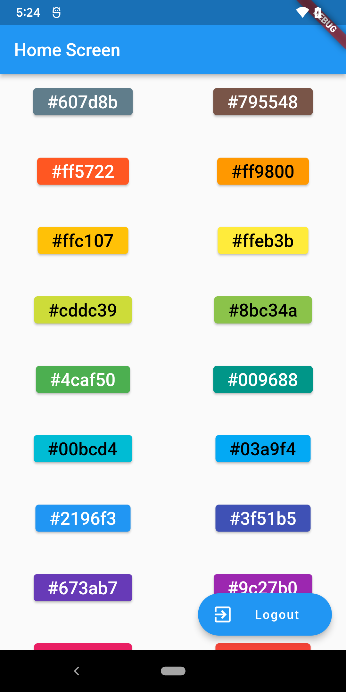
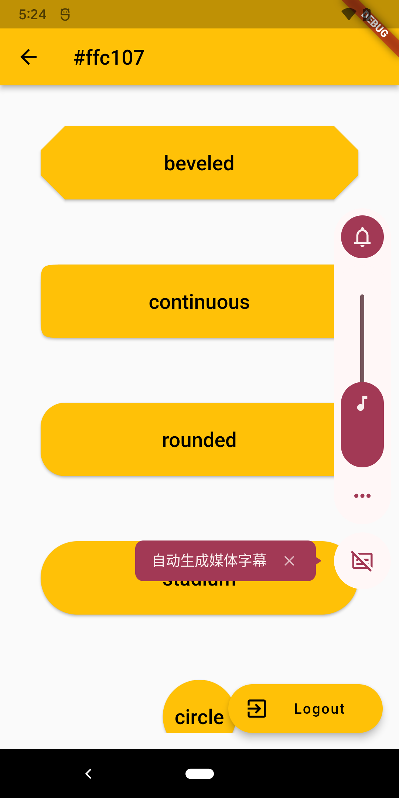

# singlepage

## Scroll to position

- [Flutter for Single-Page Scrollable Websites with Navigator 2.0 — Part 2: Scroll To Position](https://levelup.gitconnected.com/flutter-for-single-page-scrollable-websites-with-navigator-2-0-part-2-scroll-to-position-4c09cbc9d975)

### 知识点
- ValueNotifier ValueListenable
- Column|Expanded
- ScrollController
- LayoutBuilder
- NotificationListener
- ListView
  - AlwaysScrollableScrollPhysics
  - NeverScrollableScrollPhyscis 不能滚动，滚动事件被父组件拦截

- flutter_web_plugins

ValueNotifier是 ValueListenable的子类 可通知它的订阅者(listeners)

ValueListenableBuilder 可以将有状态的组件转换为无状态的组件，关键属性：builder, valueListenable

路径策略

Flutter Web 应用支持两种基于 URL 的路由的配置方式：

- Hash（默认）
路径使用 # + 锚点标识符 读写，例如：flutterexample.dev/#/path/to/screen。

- Path
路径使用非 # 读写，例如：flutterexample.dev/path/to/screen。

## Ensure Visible
[Flutter for Single-Page Scrollable Websites with Navigator 2.0 — Part 4: Ensure Visible](https://ulusoyca.medium.com/flutter-for-single-page-scrollable-websites-with-navigator-2-0-part-4-ensure-visible-145eba88d742)

使用SingleChildScrollView一次性全部构建子组件

## Scroll to index
[Scroll To Index](https://ulusoyca.medium.com/flutter-for-single-page-scrollable-websites-with-navigator-2-0-part-5-scroll-to-index-c38ed06ddf08)

## Query Params

[Query Params](https://ulusoyca.medium.com/flutter-for-single-page-scrollable-websites-with-navigator-2-0-part-7-query-params-deb0acfe09fa)

## Navigator 2

[Flutter Navigator 2.0 for Authentication and Bootstrapping — Part 3: Authentication](https://ulusoyca.medium.com/flutter-navigator-2-0-for-authentication-and-bootstrapping-part-3-authentication-93dbcb5f0f0a)

| login| home | shape|
| ---------------------- | ---------------------- |  ---------------------- |
|  |  |  |

[Flutter Navigator 2.0 for Authentication and Bootstrapping — Part 4: Bootstrapping](https://medium.com/codex/flutter-navigator-2-0-for-authentication-and-bootstrapping-part-4-bootstrapping-6ff60c845331)
